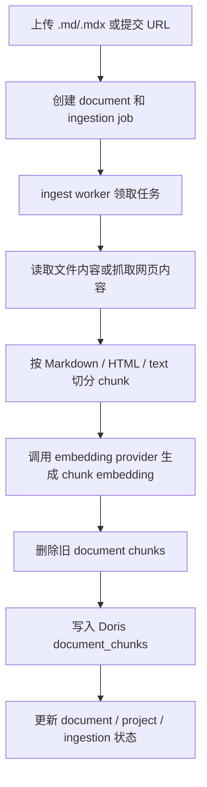
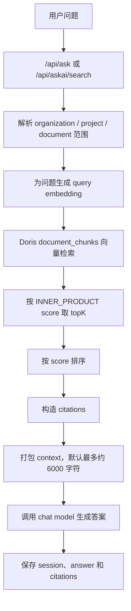

# Ask AI 向量召回历史基线版本

本文记录 Ask AI 引入混合检索前的历史基线版本：只有向量召回。这里的“向量召回”对应口语里的“向量找回”，指先把问题和文档切片转换为 embedding，再用向量相似度从 Doris 中召回相关文档片段。

当前代码基线已经升级为混合检索，见 `docs/hybrid-retrieval-baseline.md`。

## 基线定义

当前版本的核心能力是文档 chunk embedding + Doris 向量相似度检索：

- 文档入库时切分为 chunk，并为每个 chunk 生成 embedding。
- 检索时为用户问题生成 query embedding。
- Doris 在 `document_chunks` 表中用 `INNER_PRODUCT(embedding, queryEmbedding)` 计算相似度分数。
- 系统按分数返回 topK chunk，并把这些 chunk 打包成上下文交给 chat model 生成答案。
- `rerankChunks` 当前只是按向量分数重新排序，没有引入额外 rerank 模型。

关键代码路径：

- `apps/web/app/api/ask/route.ts`
- `apps/web/app/api/askai/search/route.ts`
- `packages/jobs/src/ingest-document.ts`
- `packages/rag/src/retrieval/retrieve.ts`
- `packages/doris/src/chunk-store.ts`

## 当前能力

- 项目级文档问答：在管理端选择 ready 状态的项目后提问，答案基于项目内 ready 文档生成。
- 嵌入式 Ask Widget：外部页面可以通过 `/embed.js` 加载 iframe 版问答组件，并传入 `projectId`。
- 项目 API Key 调用：外部系统可以使用项目级 API Key 调用 `/api/askai/search`。
- 会话记录：每次问答会创建或延续 ask session，保存用户问题、助手答案和引用。
- 引用返回：系统会基于召回 chunk 构造 citations，包含 document id、chunk id、标题、摘要、score 和 source URI。
- 可选 debug chunks：`/api/ask` 支持 `includeDebugChunks`，用于在管理端查看本次召回的 chunk。

## 数据入库路径

项目入库支持两类主要来源：

- 上传 `.md` / `.mdx` 文件。
- 提交 URL，由系统发现 sitemap URL 后创建入库任务。

入库任务由 worker 消费。worker 会读取源内容，按 MIME 类型选择 Markdown、HTML 或纯文本解析器，切分 chunk，生成 embedding，并写入 Doris `document_chunks` 表。PDF 解析当前保留给后续里程碑。

## 问答调用路径

当前有两条主要问答入口：

- `/api/ask`：管理端 Ask Panel 和嵌入式 Widget 使用，返回流式答案，并可返回 debug chunks。
- `/api/askai/search`：项目 API Key 使用，返回 JSON 格式的 `answer`、`citations` 和 `sessionId`。

两条入口最终都会调用同一个 Ask Docs workflow。workflow 先做向量召回，再把召回内容打包给回答模型。

默认 `topK` 是 8。`/api/askai/search` 会校验 `topK` 必须是 1 到 50 的整数；底层 Doris chunk store 也会把 `topK` 归一化到 1 到 50。

## 当前限制

当前基线版本不包含以下能力：

- 没有混合检索：只做向量检索，没有 BM25 或全文关键词检索。
- 没有元数据过滤：召回条件主要是 organization 和 document 范围，尚未按版本、语言、产品线、权限、发布时间等细粒度过滤。
- 没有二阶段 rerank：没有使用 cross-encoder 或 LLM reranker 对 top 50 / top 100 进行重排。
- 没有 query rewrite：用户原始问题直接用于生成 query embedding，没有先改写成更适合检索的 query。
- 没有多路召回：没有把标题、正文、代码块、FAQ、anchor path 分成不同通道召回后再融合。
- PDF 解析暂未开放。
- 上下文打包默认最多约 6000 字符，超过后会截断后续 chunk。
- `topK` 最大为 50。

## 未来规划

后续检索增强会按能力逐项引入，每一项都需要作为独立实验进入 Litefuse 记录和评估。只有当实验能证明准确度、引用正确性或召回质量有稳定提升时，才把该能力合入新的基线版本。

- 混合检索：向量检索 + BM25 / 全文关键词检索。目标是提升精确术语、错误码、配置项、API 名称等关键词问题的召回能力。
- 元数据过滤：支持按版本、语言、产品线、权限、发布时间等字段过滤。目标是减少跨版本、跨产品或越权文档进入上下文。
- 二阶段 rerank：先召回 top 50 / top 100，再用 cross-encoder 或 LLM reranker 重新排序。目标是提升最终进入上下文的 chunk 相关性。
- query rewrite：把用户问题改写成更适合检索的 query。目标是处理口语化、省略上下文、多轮追问和模糊问题。
- 多路召回：标题、正文、代码块、FAQ、anchor path 分开召回再融合。目标是让不同结构的文档内容用更合适的检索通道进入候选集。

## Litefuse 评估要求

每增加一个检索增强项，都必须通过 Litefuse 记录和评估准确度提升：

- 记录实验版本：标明当前启用的检索策略、参数、模型、prompt label 和代码版本。
- 记录样本结果：保存问题、召回 chunk、最终上下文、答案、引用和评估结果。
- 对比基线指标：至少对比 retrieval recall、groundedness、citation correctness、answer helpfulness 和 refusal correctness。
- 分析收益来源：区分是召回变好、排序变好、上下文变好，还是回答 prompt 变好。
- 形成新基线：增强项通过评估后，更新本文档或新增版本文档，把通过验证的能力写入新的基线。

## 关键配置

当前向量召回和回答生成依赖以下配置：

- `OPENAI_BASE_URL`
- `OPENAI_API_KEY`
- `CHAT_MODEL`
- `EMBEDDING_MODEL`
- `EMBEDDING_DIM`
- `EMBEDDING_BATCH_SIZE`
- `EMBEDDING_MAX_RETRIES`
- `DORIS_HOST`
- `DORIS_PORT`
- `DORIS_USER`
- `DORIS_PASSWORD`
- `DORIS_DATABASE`
- `DORIS_CHUNKS_TABLE`
- `DORIS_QUERY_RETRIES`
